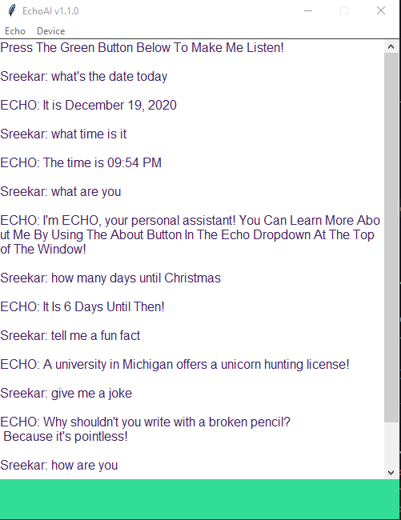

# Version 1.9.0
***
# Description
EchoAI Is A Simple AI Personal Assistant That Has Basic Functions! More Functions Are Actively Being Developed!

Please Email Me Anytime At sree23palla@outlook.com For Help, Bug Reports, Or Suggestions!

Thank You For Trying EchoAI!
***
# Here's What It Looks Like:
(Outdated Image)

***
# TODO
* Add Background Tray Icon
* Add Global Weather
* Ambient Noise Adjusting Setting
* Option To Change Font And Theme And Accent Colors In Settings
* Built-In Games
* Smart Home Integration
* Reminders
* Voice Commands For Timers
* Alarms
* Custom YouTube Music Player Integration  
* Switch To SocketServer
***
# Known Bugs
NONE
***
# License
Copyright © 2021 Sreekar Palla

Permission is hereby granted, free of charge, to any person obtaining a copy of this software and associated
documentation files (the “Software”), to deal in the Software without restriction, including without limitation the
rights to use, copy, modify, merge, publish, distribute, sublicense, and/or sell copies of the Software, and to
permit persons to whom the Software is furnished to do so, subject to the following conditions:

The above copyright notice and this permission notice shall be included in all copies or substantial portions of the
Software.

THE SOFTWARE IS PROVIDED “AS IS”, WITHOUT WARRANTY OF ANY KIND, EXPRESS OR IMPLIED, INCLUDING BUT NOT LIMITED TO THE
WARRANTIES OF MERCHANTABILITY, FITNESS FOR A PARTICULAR PURPOSE AND NONINFINGEMENT. IN NO EVENT SHALL THE AUTHORS OR
COPYRIGHT HOLDERS BE LIABLE FOR ANY CLAIM, DAMAGES OR OTHER LIABILITY, WHETHER IN AN ACTION OF CONTRACT, TORT OR
OTHERWISE, ARISING FROM, OUT OF OR IN CONNECTION WITH THE SOFTWARE OR THE USE OR OTHER DEALINGS IN THE SOFTWARE.
***